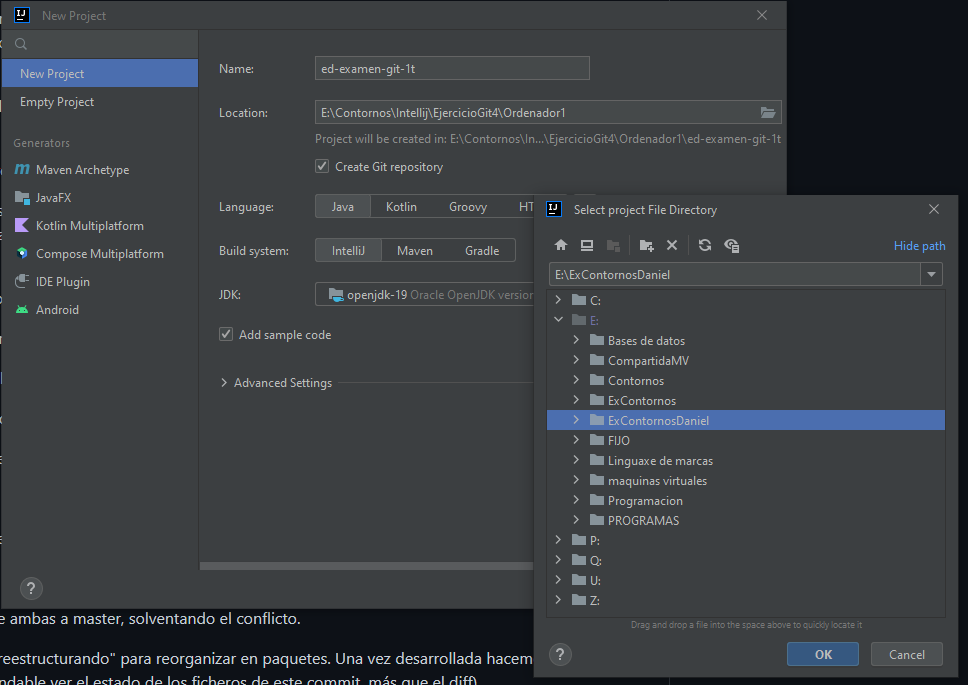
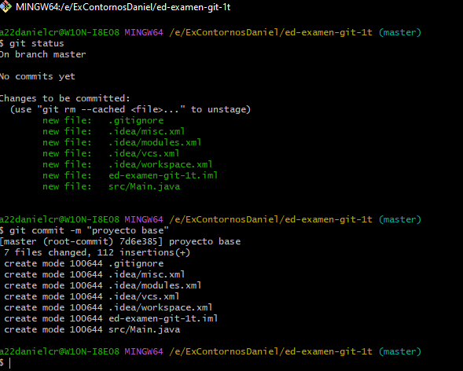
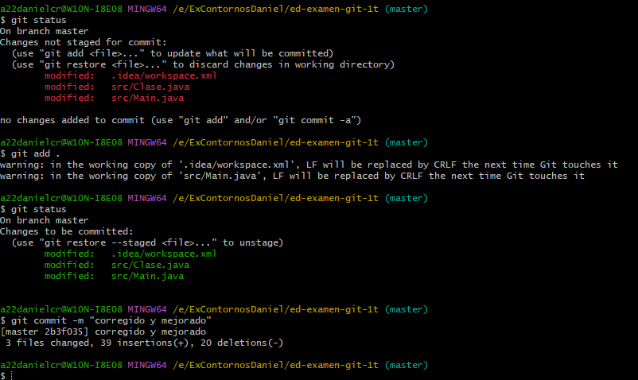
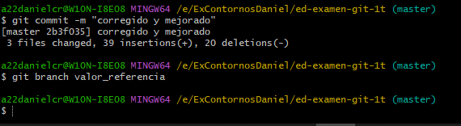
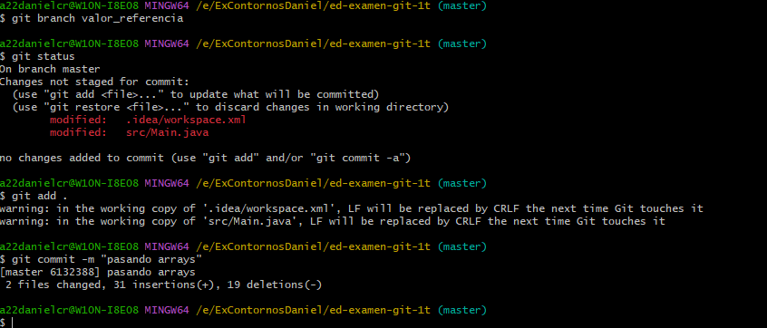
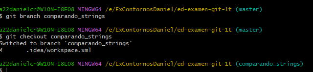
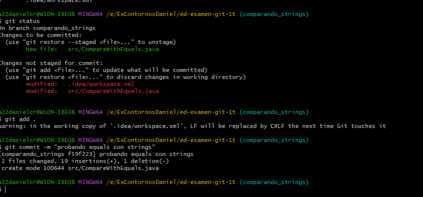
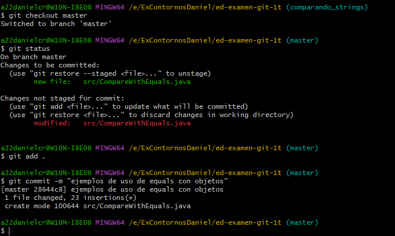
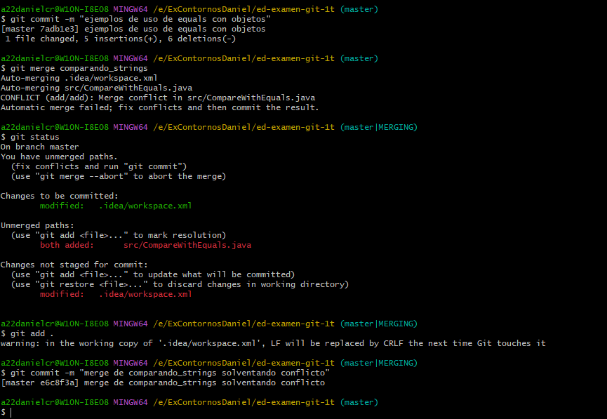

Entornos de Desarrollo - Examen 1T

Nombre completo: Daniel Campos Rocha
Grupo: DAM

1 Inicialmente se crea un proyecto en Intellij con codigo de ejemplo y un repositorio de Github

2 Con el proyecto creado se genera el primer commit

3 se crea la clase Clase y se modifica el Main, con eso hecho se realiza git status, git add., git status(para comprobar que todo esta correcto)
y se crea el segundo commit

4 se corrige y se mejora el programa git status,git add . y git commit -m "corregido y mejorado"

5 Se crea la rama valor_referencia

6 siguiendo en master modificamos el programa y comiteamos "pasando arrays"

7 se crea la rama comparando_strings

8 en la nueva rama se modifica codigo y comparandoEqueals con strings

9 ejemplos de uso de equals con strings

10 merge master con comparandocon strings

